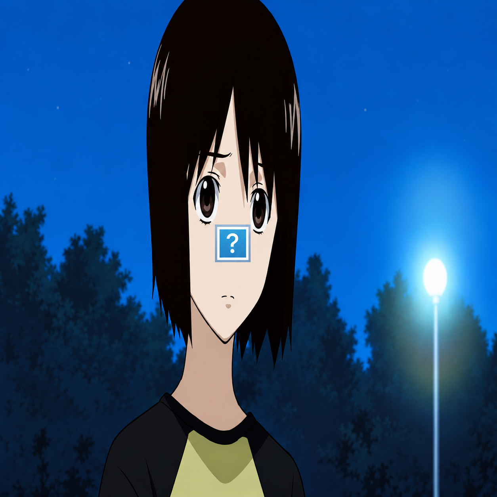

  

<h1 align="center">1fever</h1>

alias 1f3v

  Je construis des interfaces qui ont leur propre ambiance. 
  Du mouvement, de la musique et une attention particulière aux détails.

 

### En ce moment

Je développe mon espace personnel : une page de profil interactive avec effets 3D, lecteur audio, paroles synchronisées et édition en direct.

Le même soin sur ordinateur et sur mobile.

 

### Mes outils

  
  
  
  

 

  1fever · alias 1f3v

